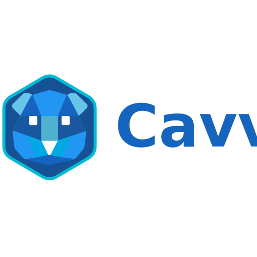

<p align="center">
  
</p>

<h1 align="center">Cavvy Programming Language</h1>

<p align="center">
  English | <a href="README.md">简体中文</a>
</p>

<p align="center">
  
  
  
  
  
</p>

<p align="center">
  
  
</p>

---

Cavvy (Cay) is a statically-typed, object-oriented programming language that compiles to native machine code with no runtime dependencies, no VM, and no GC.

**Core Features:**
- 🚀 **Native Performance**: Compiles to Windows EXE / Linux ELF with zero-cost abstractions
- 🛡️ **Memory Safety**: Explicit memory management with RAII pattern support
- ☕ **Java-style Syntax**: Familiar object-oriented programming experience
- 🔧 **Complete Toolchain**: One-stop compilation from source to executable
- 🌉 **FFI Support**: Seamless calling of C functions and system libraries
- 📦 **Bytecode System**: Supports `.caybc` format and code obfuscation

---

## Table of Contents

- [Quick Start](#quick-start)
- [Installation](#installation)
- [Language Features](#language-features)
- [Toolchain](#toolchain)
- [Code Examples](#code-examples)
- [Project Structure](#project-structure)
- [Development Status](#development-status)
- [License](#license)

---

## Quick Start

### Write Your First Program

Create a file `hello.cay`:

```cay
public class Hello {
    public static void main() {
        println("Hello, World!");
    }
}
```

Or use top-level main function (0.4.3+):

```cay
public int main() {
    println("Hello from top-level main!");
    return 0;
}
```

### Compile and Run

```bash
# Compile using cayc (one-stop compiler)
./target/release/cayc hello.cay hello.exe

# Run
./hello.exe
```

---

## Installation

### Build from Source

```bash
# Clone the repository
git clone https://github.com/Ethernos-Studio/Cavvy.git
cd eol

# Build the compiler (Release mode)
cargo build --release

# Run tests
cargo test --release
```

### System Requirements

- **Windows**: Windows 10/11 x64
- **Linux**: x86_64 Linux distributions
- **Dependencies**: LLVM 17.0+, MinGW-w64 13.2+ (Windows)

---

## Language Features

### Basic Type System

```cay
// Integer types
int a = 10;
long b = 100L;

// Floating-point types
float f = 3.14f;
double d = 3.14159;

// Other basic types
boolean flag = true;
char c = 'A';
String s = "Hello, Cavvy!";

// Auto type inference (0.4.3+)
auto x = 42;        // int
auto pi = 3.14;     // double
auto msg = "hi";    // String
```

### Arrays

```cay
// One-dimensional arrays
int[] arr = new int[5];
int[] initArr = {1, 2, 3, 4, 5};

// Multi-dimensional arrays
int[][] matrix = new int[3][3];
int[][] grid = {{1, 2}, {3, 4}, {5, 6}};

// Array length
int len = arr.length;

// Array access
arr[0] = 100;
int val = arr[0];
```

### Control Flow

```cay
// if-else
if (a > b) {
    println("a is greater");
} else if (a == b) {
    println("a equals b");
} else {
    println("a is smaller");
}

// switch statement
switch (value) {
    case 1:
        println("one");
        break;
    case 2:
        println("two");
        break;
    default:
        println("other");
        break;
}

// Loops
for (int i = 0; i < 10; i++) {
    println(i);
}

long j = 0;
while (j < 10) {
    println(j);
    j++;
}

// do-while
int k = 0;
do {
    println(k);
    k++;
} while (k < 5);
```

### Object-Oriented Programming

```cay
// Class definition and inheritance
public class Animal {
    protected String name;
    
    public Animal(String name) {
        this.name = name;
    }
    
    public void speak() {
        println("Some sound");
    }
}

public class Dog extends Animal {
    public Dog(String name) {
        super(name);
    }
    
    @Override
    public void speak() {
        println(name + " says: Woof!");
    }
}

// Abstract classes and interfaces
public abstract class Shape {
    public abstract double area();
}

public interface Drawable {
    void draw();
}
```

### Method Overloading and Varargs

```cay
public class Calculator {
    // Method overloading
    public static int add(int a, int b) {
        return a + b;
    }
    
    public static double add(double a, double b) {
        return a + b;
    }
    
    // Variable arguments
    public static int sum(int... numbers) {
        int total = 0;
        for (int i = 0; i < numbers.length; i++) {
            total = total + numbers[i];
        }
        return total;
    }
}
```

### Lambda Expressions and Method References

```cay
// Lambda expressions
var add = (int a, int b) -> { return a + b; };
int result = add(3, 4);

// Shorthand form
var multiply = (int a, int b) -> a * b;

// Method reference
var ref = Calculator::add;
```

### String Operations

```cay
String s = "Hello World";

// String methods
int len = s.length();
String sub = s.substring(0, 5);
int idx = s.indexOf("World");
String replaced = s.replace("World", "Cavvy");
char ch = s.charAt(0);

// String concatenation
String msg = "Hello, " + name + "!";
```

### FFI - Calling C Functions

```cay
// Declare external C functions
extern {
    int abs(int x);
    double sqrt(double x);
    int strlen(String s);
}

public class MathExample {
    public static void main() {
        int result = abs(-42);
        double root = sqrt(2.0);
        println("Abs: " + result);
        println("Sqrt: " + root);
    }
}
```

### Final and Static Members

```cay
public class Constants {
    // Compile-time constant
    public static final double PI = 3.14159;
    
    // Static initialization block
    static {
        println("Class initialized");
    }
    
    // Final class/method
    public final class Immutable { }
}
```

---

## Toolchain

This project provides six executables:

| Tool | Function | Usage |
|------|----------|-------|
| `cayc` | Cavvy → EXE (one-step) | `cayc source.cay output.exe` |
| `cay-ir` | Cavvy → LLVM IR | `cay-ir source.cay output.ll` |
| `ir2exe` | LLVM IR → EXE | `ir2exe input.ll output.exe` |
| `cay-check` | Syntax checking | `cay-check source.cay` |
| `cay-run` | Direct execution | `cay-run source.cay` |
| `cay-bcgen` | Bytecode generation | `cay-bcgen source.cay output.caybc` |

### Compilation Options

```bash
# Basic compilation
cayc hello.cay hello.exe

# Optimization levels
cayc -O3 hello.cay hello.exe        # Maximum optimization
cayc -O0 hello.cay hello.exe        # No optimization (debug)

# Bytecode obfuscation
cayc --obfuscate --obfuscate-level deep hello.cay hello.exe

# Link libraries
cayc -lm hello.cay hello.exe        # Link math library

# Cross-platform target
cay-ir --target x86_64-linux-gnu hello.cay hello.ll
```

---

## Code Examples

### Multiplication Table

```cay
public class Multiplication {
    public static void main() {
        for (int i = 1; i <= 9; i++) {
            for (int j = 1; j <= i; j++) {
                print(j + "x" + i + "=" + (i*j) + "\t");
            }
            println("");
        }
    }
}
```

### Fibonacci Sequence

```cay
public class Fibonacci {
    // Recursive implementation
    public static long fib(int n) {
        if (n <= 1) return n;
        return fib(n - 1) + fib(n - 2);
    }
    
    // Iterative implementation
    public static long fibIterative(int n) {
        if (n <= 1) return n;
        long a = 0, b = 1;
        for (int i = 2; i <= n; i++) {
            long temp = a + b;
            a = b;
            b = temp;
        }
        return b;
    }
    
    public static void main() {
        for (int i = 0; i < 20; i++) {
            println("fib(" + i + ") = " + fibIterative(i));
        }
    }
}
```

### Bubble Sort

```cay
public class Sorting {
    public static void bubbleSort(int[] arr) {
        int n = arr.length;
        for (int i = 0; i < n - 1; i++) {
            for (int j = 0; j < n - i - 1; j++) {
                if (arr[j] > arr[j + 1]) {
                    int temp = arr[j];
                    arr[j] = arr[j + 1];
                    arr[j + 1] = temp;
                }
            }
        }
    }
    
    public static void main() {
        int[] numbers = {64, 34, 25, 12, 22, 11, 90};
        bubbleSort(numbers);
        
        print("Sorted: ");
        for (int i = 0; i < numbers.length; i++) {
            print(numbers[i] + " ");
        }
        println("");
    }
}
```

---

## Project Structure

```
cavvy/
├── src/                    # Source code
│   ├── bin/               # Executables
│   │   ├── cayc.rs        # One-step compiler
│   │   ├── cay-ir.rs      # Cavvy → IR compiler
│   │   ├── ir2exe.rs      # IR → EXE compiler
│   │   ├── cay-check.rs   # Syntax checker
│   │   ├── cay-run.rs     # Direct execution tool
│   │   ├── cay-bcgen.rs   # Bytecode generator
│   │   └── cay-lsp.rs     # LSP language server
│   ├── lexer/             # Lexical analyzer
│   ├── parser/            # Syntax analyzer
│   ├── semantic/          # Semantic analyzer
│   ├── codegen/           # Code generator
│   ├── ast.rs             # AST definitions
│   ├── types.rs           # Type system
│   └── error.rs           # Error handling
├── examples/              # Example programs
├── caylibs/               # Standard library
├── docs/                  # Documentation
│   └── README/images/     # README image assets
├── tests/                 # Test suite
├── llvm-minimal/          # LLVM toolchain
├── mingw-minimal/         # MinGW linker
└── Cargo.toml             # Rust project configuration
```

---

## Development Status

### Current Version: 0.4.8

**Completed Features (0.4.x):**

- [x] Basic type system (int, long, float, double, boolean, char, String, void)
- [x] Variable declaration and assignment (supports var/let/auto)
- [x] Arithmetic operators (+, -, *, /, %)
- [x] Comparison operators (==, !=, <, <=, >, >=)
- [x] Logical operators (&&, ||, !)
- [x] Bitwise operators (&, |, ^, ~, <<, >>)
- [x] Increment/decrement operators (++, --)
- [x] Compound assignment operators (+=, -=, *=, /=, %=)
- [x] Conditional statements (if-else, switch)
- [x] Loop statements (while, for, do-while)
- [x] break/continue support
- [x] Arrays (one-dimensional and multi-dimensional)
- [x] Array initializers and length property
- [x] String concatenation and methods
- [x] Type casting (explicit and implicit)
- [x] Method overloading
- [x] Variable arguments
- [x] Lambda expressions
- [x] Method references
- [x] Classes and single inheritance
- [x] Abstract classes and interfaces
- [x] Access control (public/private/protected)
- [x] Constructors and destructors
- [x] Final classes and Final methods
- [x] Static members and static initialization
- [x] @Override annotation
- [x] Top-level main function
- [x] FFI foreign function interface
- [x] Auto linker
- [x] Bytecode system (CayBC)
- [x] Code obfuscation
- [x] LSP language server
- [x] Windows / Linux cross-platform support

### Development Roadmap

See [ROADMAP.md](ROADMAP.md) for details.

**Coming Soon (0.5.x):**
- Allocator interface and Arena allocator
- Generic collections (ArrayList, HashMap)
- Smart pointers (UniquePtr, ScopedPtr)
- Result<T, E> error handling
- OS thread encapsulation

---

## Tech Stack

<p align="center">
  
</p>

- **Frontend**: Rust-based lexical analysis, syntax analysis, semantic analysis
- **Middle-end**: LLVM IR code generation
- **Backend**: MinGW-w64 / GCC toolchain
- **Bytecode**: Custom CayBC format (stack-based VM)

---

## License

<p align="center">
  
</p>

This project is licensed under the GPL3 License. See the [LICENSE](LICENSE) file for details.

---

## Contributing

Issues and Pull Requests are welcome.

- 🐛 **Bug Reports**: Use GitHub Issues
- 💡 **Feature Suggestions**: Check ROADMAP.md first, then submit PR
- 📖 **Documentation Improvements**: Edit docs and submit directly

---

## Acknowledgments

- [LLVM Project](https://llvm.org/)
- [MinGW-w64](https://www.mingw-w64.org/)
- [Rust Programming Language](https://www.rust-lang.org/)

---

<p align="center">
  <strong>Cavvy - Compile the Future</strong>
</p>
